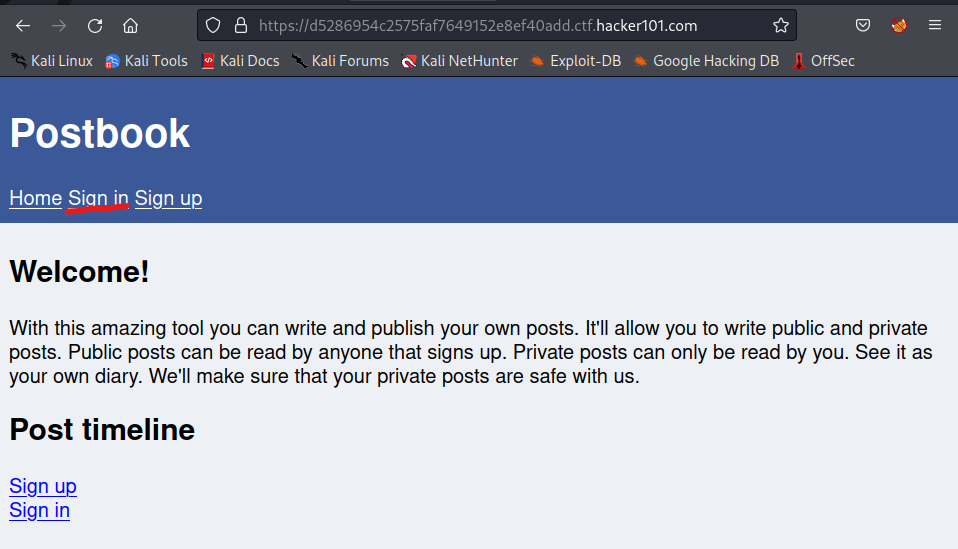
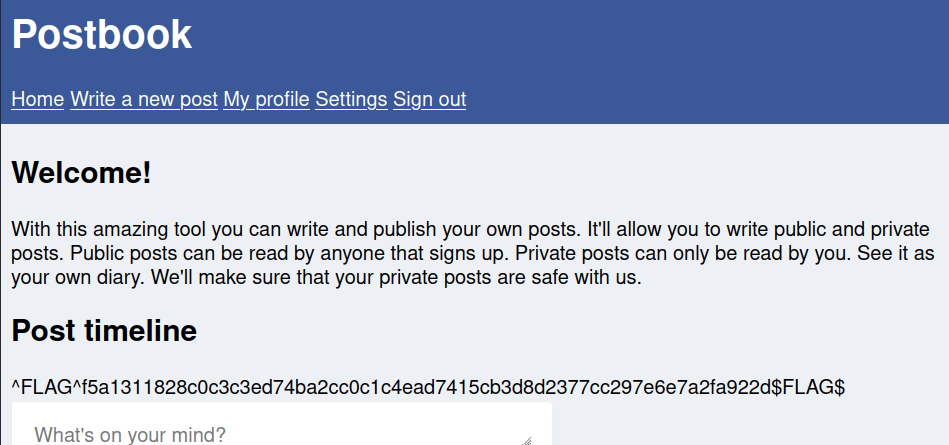

# Flag 0

---
1. For flag 0 we know it has something to do with weak authentication (No. 7: Identification and Authentication Failures on the [OWASP Top 10](https://owasp.org/www-project-top-ten/). Because of this the first step is to navigate to the sign in page. 

2. From the sign in page there are a few things that would be logical to try. These might be things like:
  - Putting in a few random values to see if you get a specific error message like "Incorrect Username" or similar.
  - Putting in some special characters like single quote ('), double quote ("), pound sign (#), curly brackets (}), etc. to test for error codes indicitave of SQL or    NoSQL injection possibilities. 

**However**, for step two it's even simpler than that. We just need to check for generic or otherwise easy to find usernames and passwords. For this there are two approaches. 
- The guess and hope approach. For this approach you will just enter in whatever you can think of. This will be usernames such as admin, administrator, user, guest, visitor, person, etc. And common passwords such as 12345, password, abc123, test, etc. Usually you won't want your list being too long for the sake of time, but for this challenge it works pretty well and is how we are going to go about it.. 
- Using a tool such as Hydra or Burp to iterate a list of common username and passwords to find a matching combo. 
3. After playing around with the login and entering some common values we will find that ther is a user called 'user' and a password called 'password'. Sign in with these.
4. This is where we will find our first flag.

---
[Home](./Readme.md) [Next](./Flag1.md)

