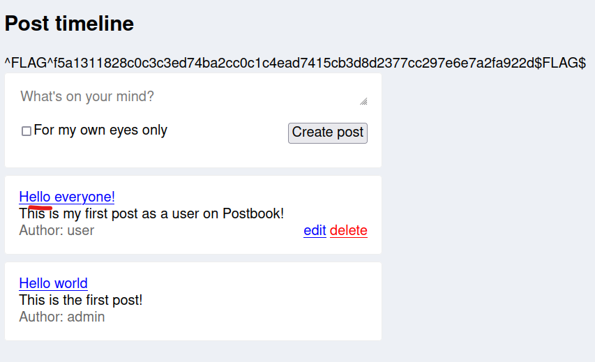
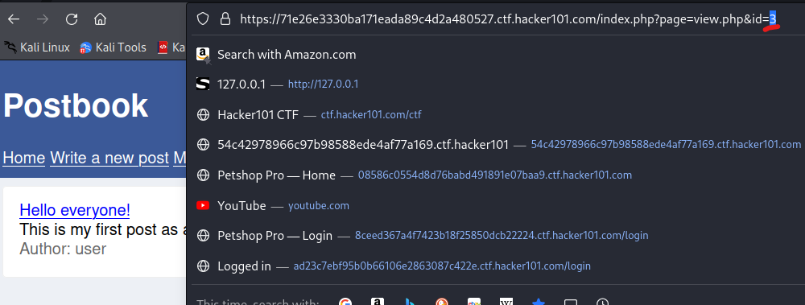
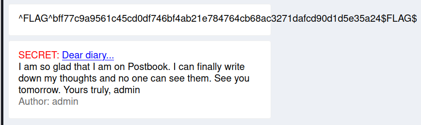

# Flag 1
Flag 1 focuses on direct object refrencing which can be encompassed into the top vulnerability on the OWASP Top 10, BAC or broken access control (not blood alcohol content).

---
1. From the main authenticated screen click on the default post that has been made for Author: user.

2. In the URL change the id parameter to something other than 3 like 2 or 1. 

3. We will see that post 2 was a secret post meant to be only viewable by the admin user. This is our next flag, Flag 1. 

---
[Home](./Start.MD) [Back](./Flag0.md) [Next](./Flag2.md)
