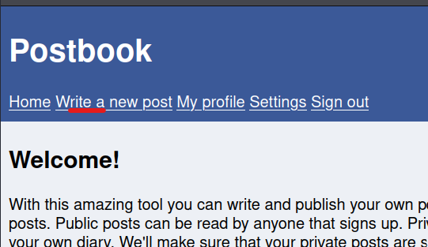
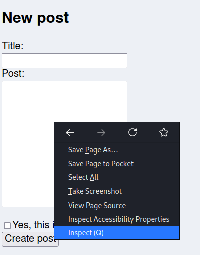
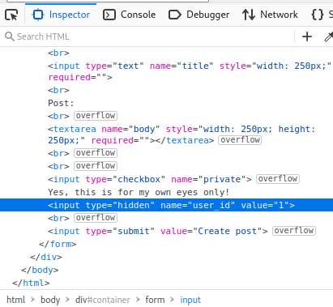
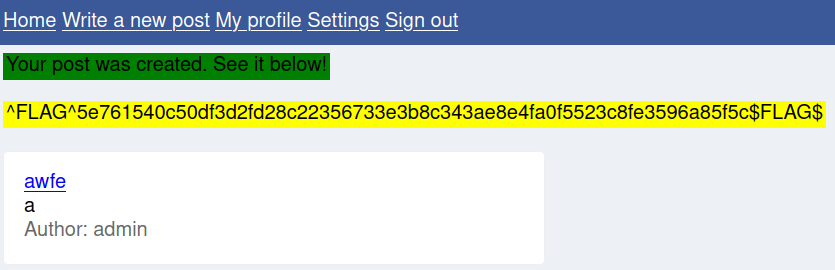

# Flag 2
For this flag we will be dealing with hidden form parameters. This is something that you don't see too often as it relies on obscurity in place of cryptography to keep secrets secret, landing it in the category of Cryptographic Failures on the [OWASP Top 10](https://owasp.org/www-project-top-ten/).

---

1. From anyware on the application click 'Write a New Post' in the navbar. 

2. From the new post page right click on any part of the input form and select inspect element.

3. Look through the html to see if you can find the hidden element.  

4. Change the hidden input value from whatever it is to 1, then create your post.
5. The post will show as being created by the admin and you will have Flag 2. 

---
[Home](./Readme.md) [Back](./Flag1.md) [Next](./Flag3.md)
