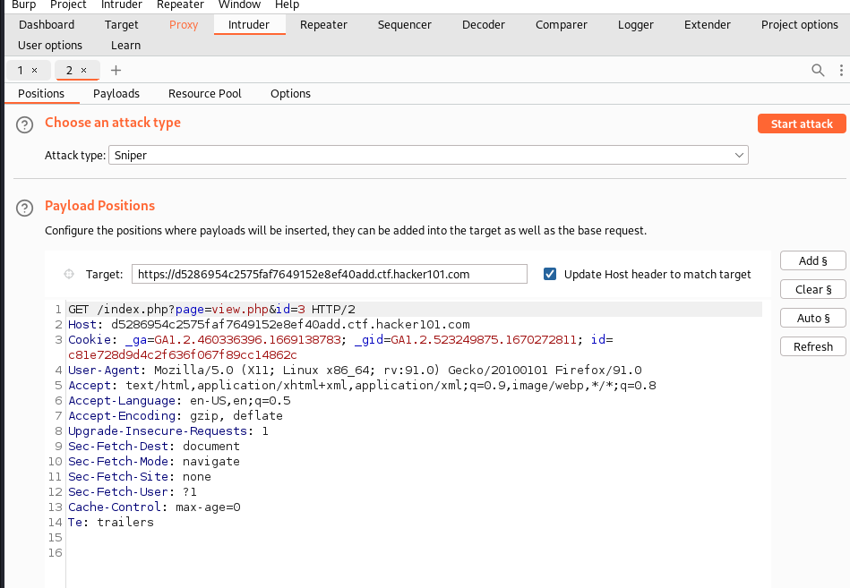
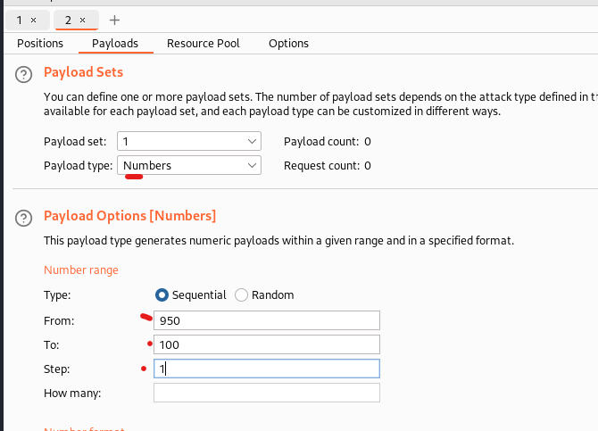
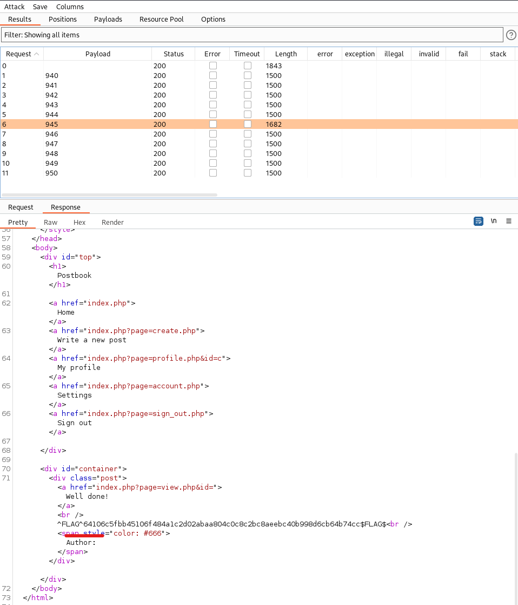

# Flag 3
This obstacle will be dealing with something called forced browsing and will implement techniques such as directory/url brute force discover. 

---

1. Open up any post.
2. In Burp on the proxy and intercept tabs, toggle the intercept button.
3. Refresh the page. 
4. Right click on the request in Burp and select seld to Intruder. 
5. Select the Intruder tab in Burp. 
6. On the right hand side select 'Clear'.

7. Highlight the ID number in the request header and then select the 'Add' button on the right hand side. 
8. We can leave the attack type as 'Sniper' and then hit the 'Payloads' tab. 
9. On the payloads screen change the payload type to 'Numbers'. Then enter a starting value, ending value, and increment value for the attack. (I chose 940 to 1000 because I've done this before. You would likely want to want to use a higher range.)  

10. Click 'Start Attack'. Note: With the Burp community edition requests are throttled so for large requests this can take some time. Grab some popcorn and relax.
11. This part is tough to do with Burp community unless you know what number you're looking for so something like OWASP ZAP (fuzz tool) might be better for this attack. A good resource to get started with this can be found [here](https://medium.com/geekculture/%EF%B8%8Fstop-using-burp-suite-use-zap-fd68bf12d63e) but in Burp if you look at the response from request with payload 945 you will find Flag number 3.  

---
[Home](./Readme.md) [Back](./Flag2.md) [Next](./Flag4.md)
