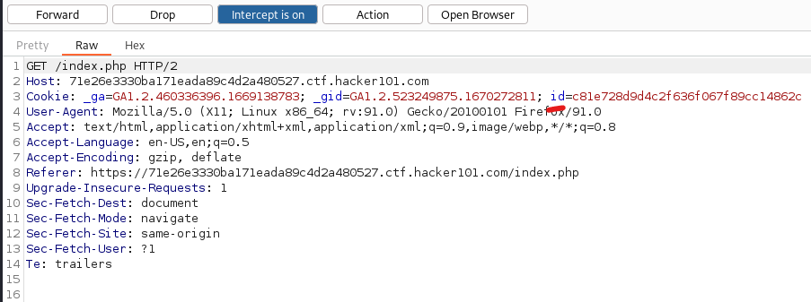
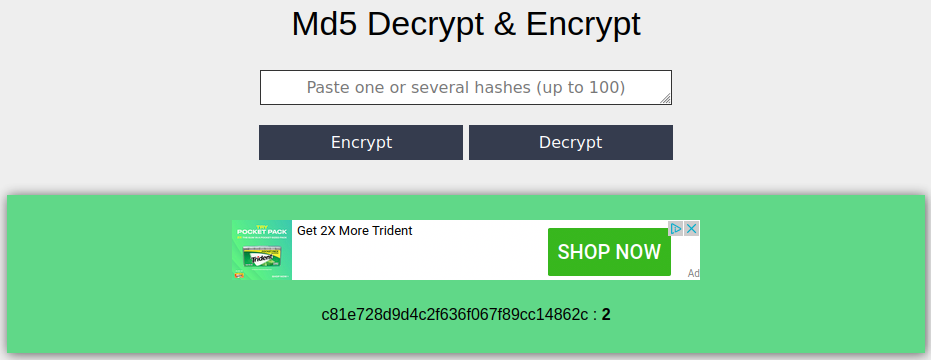
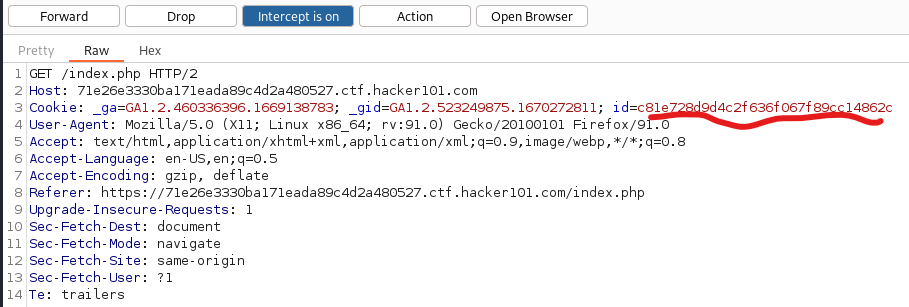
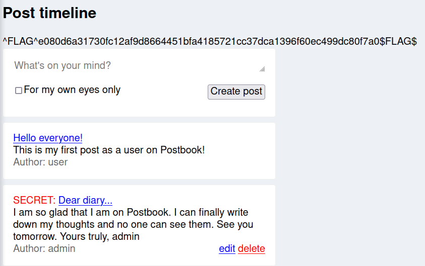

# Flag 5
Flag 5 deals with two of the [OWASP Top 10](https://owasp.org/www-project-top-ten/). Number 2: Cryptographic Failures and Number 7: Identification and Authentication Failures.

---
1. In Burp on in the Proxy tab and the Intruder sub tab toggle the Intercept feature. 
2. In the web application select the 'Home' button. 
3. In the intercepted request we can see there is a cookie parameter with the key of 'id'. Highlight this value and copy it to the clipboard. You can run this through hash analyzers to see if it's a weak hash or encryption. In this case we will guess that it's either MD5 or MD4 based on the context of the challenge and the look of it. 

4. Head to the [Online MD5 Decrypt tool](https://md5decrypt.net/en/), paste in your value, and hit 'Decrypt'.
5. The site will quickly find that the value is decrypted to the value '2'. 

6. Still on the decrypt tool enter the number '1' into the search box and this time hit the 'Encrypt' button. You will get a new hash. 

7. Copy this hashed value. In Burp toggle intercept back to the on position and hit the 'Home' button again in postbook. Replace the id parameter with the new hash value. 

8. Here we will find Flag 5. 

---
[Home](./Start.MD) [Back](./Flag4.md) [Next](./Flag6.md)
