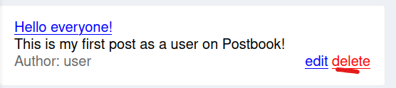
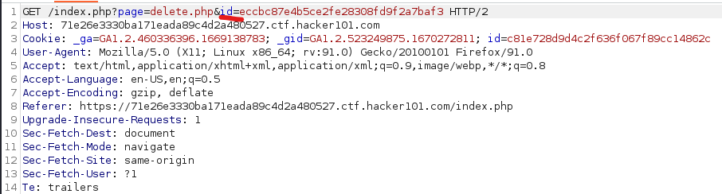
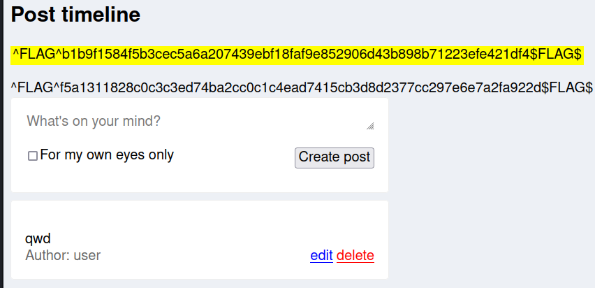

# Flag 6
Don't put away your [MD5 Decryptor](https://md5decrypt.net/en/) just yet! Here comes another. 

---

1. In Burp toggle the intercept feature on the Proxy>Intercept tab. 
2. From the home page of Postbook hit 'delete'. Next to your post. 

3. In Burp find the id being sent as a url parameter, highlight it, and copy it to the clipboard. 
)
4. Same as the last flag paste your hash in and hit decrypt. You should find it evaluates to the number '3'. 
5. Armed with this information put in the value '1' and hit encrypt. Copy the hash.
6. Go back to Burp and toggle intercept to 'on' again. 
7. Again select 'delete' next to one of your posts (you may need to create a new post first if you deleted your only post).
8. In Burp replace the id parameter with the new hash. 
9. And here we will find our final flag. 

---
[Home](./Start.MD) [Back](./Flag5.md)
